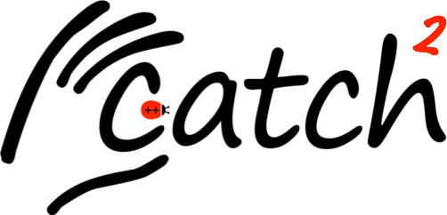

<a href="https://github.com/catchorg/Catch2/releases/download/v2.4.0/catch.hpp">The latest version of the single header can be downloaded directly using this link</a>

The header path should be defined in the CATCH_INCLUDE_DIR env variable.
Some C++ examples with Catch tests:

- SequenceVec: Check if a given vector of integers is a sequence.
- Factorial: Given a integer returns its factorial.
- AttrParser: Given a markup language returns its tags values.
